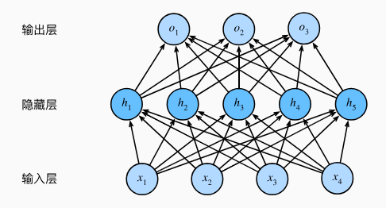
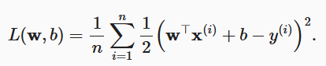
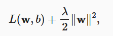
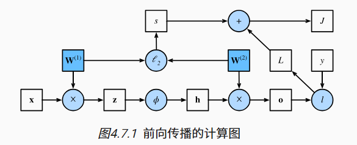
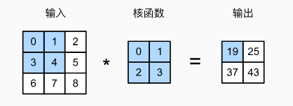
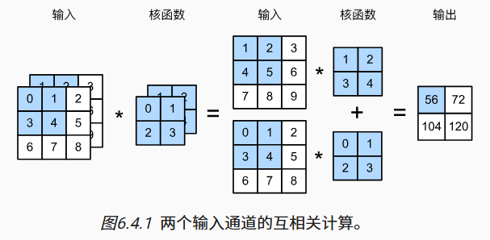
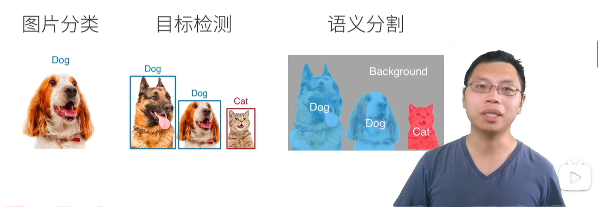
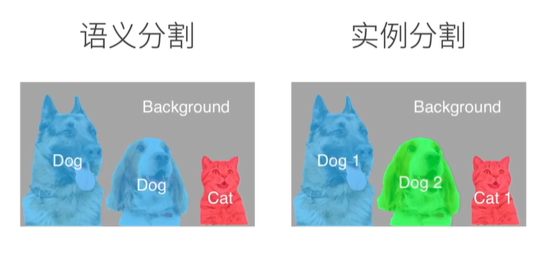

**Point Cloud**
<link rel="stylesheet" type="text/css" href="auto-number-title.css" />

Markdown 教程：https://markdown.com.cn/basic-syntax/
- [Lidar 运动补偿](#lidar-运动补偿)
  - [点云预处理](#点云预处理)
  - [使用 IMU 进行补偿](#使用-imu-进行补偿)
    - [时间戳问题](#时间戳问题)
- [点云配准](#点云配准)
- [深度学习基础](#深度学习基础)
  - [多层感知机 (MLP)](#多层感知机-mlp)
    - [激活函数](#激活函数)
    - [训练误差与泛化误差](#训练误差与泛化误差)
    - [训练集、验证集、测试集](#训练集验证集测试集)
    - [欠拟合与过拟合](#欠拟合与过拟合)
    - [权重衰减](#权重衰减)
    - [前向传播、反向传播、计算图](#前向传播反向传播计算图)
    - [参数初始化](#参数初始化)
  - [深度学习计算](#深度学习计算)
    - [层和块](#层和块)
    - [参数管理、读写文件](#参数管理读写文件)
  - [卷积神经网络](#卷积神经网络)
    - [填充和步幅](#填充和步幅)
    - [多通道输入输出](#多通道输入输出)
- [3D 语义分割](#3d-语义分割)

# Lidar 运动补偿
https://blog.csdn.net/brightming/article/details/118250783

https://blog.csdn.net/qq_30460905/article/details/124919036

**代码：**~/PointCloud/PointCloud_ws/src/motion_compensation

## 点云预处理
加载 livox 头文件，使用 livox CustomMsg 格式点云

    cpp：
    #include <livox_ros_driver/CustomMsg.h>

    CMakeLists.txt:
    find_package(catkin REQUIRED COMPONENTS
    livox_ros_driver
    )

    package.xml:
    <build_depend>livox_ros_driver</build_depend>
    <exec_depend>livox_ros_driver</exec_depend>
## 使用 IMU 进行补偿
参考 Fast-LIO 中的函数

    void ImuProcess::UndistortPcl
    (const MeasureGroup &meas, esekfom::esekf<state_ikfom, 12, input_ikfom> &kf_state, PointCloudXYZI &pcl_out)
### 时间戳问题
livox 格式点云每个点都有自己的时间戳，官方驱动时间从启动为0开始，且雷达内置 imu 也如此；r3live的驱动时间戳为ros time，需要可以使用r3live的驱动

    pl_full[i].curvature = (msg->timebase + msg->points[i].offset_time) / float(1000000);
这里不能简单替换为 ros::Time::now() ！！！

使用官方驱动时，启动 livox 驱动的 ros time 为 T1，启动后第一帧点云时间戳为 0，dt = T1；在其他算法中这个 T1 我们不知道，无法将点云时间戳同步到 rostime。

# 点云配准

# 深度学习基础

动手学深度学习：https://zh-v2.d2l.ai/

## 多层感知机 (MLP)
可以通过在网络中加入一个或多个隐藏层来克服线性模型的限制， 这种架构通常称为多层感知机（multilayer perceptron），通常缩写为 MLP

这个多层感知机有4个输入，3个输出，其隐藏层包含5个隐藏单元，输入层不涉及计算，隐藏层和输出层有计算，这个 MLP 的层数为2

多层感知机在输出层和输入层之间增加一个或多个全连接隐藏层，并通过激活函数转换隐藏层的输出。

### 激活函数
将神经网络非线性化，如果不用激活函数，每一层输出都是上层输入的线性函数，无论神经网络有多少层，输出都是输入的线性组合

常用激活函数：ReLU、sigmoid、tanh

### 训练误差与泛化误差
**训练误差（training error）**：模型在训练数据集上计算得到的误差

**泛化误差（generalization error）**：模型应用在同样从原始样本的分布中抽取的无限多数据样本时，模型误差的 ***期望*** 。说白了就是在训练集上没见过的数据的错分样本比率？
### 训练集、验证集、测试集
常见做法是将我们的数据分成三份：
1. **训练集**：训练集用来训练模型，即确定模型的权重和偏置这些参数
2. **验证集**：验证集用于模型的选择，比较具有不同数量的隐藏层、不同数量的隐藏单元以及不同的激活函数组合的模型
3. **测试集**：测试集只使用一次，即在训练完成后评价最终的模型时使用

**K 折交叉验证：**

当训练数据稀缺时, 原始训练数据被分成 K 个不重叠的子集。 然后执行 K 次模型训练和验证

每次在 K-1 个子集上进行训练， 并在剩余的一个子集（在该轮中没有用于训练的子集）上进行验证

### 欠拟合与过拟合
**欠拟合**：训练误差和验证误差都很严重， 但它们之间仅有一点差距

**过拟合**：训练误差明显低于验证误差时要小心

<!--  -->

### 权重衰减
**目的**：限制模型复杂度，抑制模型的过拟合，提高模型的泛化性

**方法**：在训练集的损失函数中加入惩罚项，以降低学习到的模型的复杂度， 将原来的训练目标最小化训练标签上的预测损失， 调整为最小化预测损失和惩罚项之和

正常的损失函数：

加入一个额外的损失 **（权重的L2范数）** 来限制权重向量的大小，通过 **正则化常数 λ** 平衡这个新的额外惩罚的损失

https://blog.csdn.net/zhaohongfei_358/article/details/129625803

### 前向传播、反向传播、计算图

**前向传播**：按顺序（从输入层到输出层）计算和存储神经网络中每层的结果。

输入样本为 $\mathbf{x}$ 中间变量为 $\mathbf{z}$，$\mathbf{W}^{(1)}$ 为隐藏层的权重参数
$$\mathbf{z}= \mathbf{W}^{(1)} \mathbf{x}$$
激活函数为 $\phi$
$$\mathbf{h}= \phi (\mathbf{z})$$
输出层的参数只有 $\mathbf{W}^{(2)}$
$$ \mathbf{o}= \mathbf{W}^{(2)} \mathbf{h} $$
损失函数 l 样本标签 y
$$L = l(\mathbf{o}, y)$$
正则化项（权重衰减）为
$$ s = \frac{\lambda}{2} \left(\|\mathbf{W}^{(1)}\|_F^2 + \|\mathbf{W}^{(2)}\|_F^2\right)$$
最后，模型在给定数据样本上的正则化损失为
$$J = L + s.$$
将 $J$ 称为目标函数（objective function）

前向传播的计算图如下，其中正方形表示变量，圆圈表示操作符。左下角表示输入，右上角表示输出

**反向传播**：（backward propagation或backpropagation）指的是计算神经网络参数**梯度**的方法

在上面计算图中，反向传播用于计算梯度 $\partial J/\partial \mathbf{W}^{(1)}$ 和 $\partial J/\partial \mathbf{W}^{(2)}$ 应用链式法则，依次计算每个中间变量和参数的梯度

### 参数初始化
Xavier 初始化可以避免梯度消失和梯度爆炸

## 深度学习计算
### 层和块
块（block）可以描述单个层、由多个层组成的组件或整个模型本身
 
块负责大量的内部处理，包括参数初始化和反向传播

### 参数管理、读写文件

## 卷积神经网络

卷积层对输入和卷积核权重进行互相关运算，并在添加标量偏置之后产生输出

卷积层中的两个被训练的参数是卷积核权重和标量偏置

感受野：指特征图上的某个点能看到的输入图像的区域，特征图上的点是由输入图像中感受野大小区域的计算得到的

### 填充和步幅
在应用多层卷积时，我们常常丢失边缘像素，在周围填充一圈0

卷积神经网络中卷积核的高度和宽度通常为奇数，保持空间维度的同时，可以在顶部和底部填充相同数量的行，在左侧和右侧填充相同数量的列

步幅分为水平步幅和垂直步幅

填充和步幅可用于有效地调整数据的维度

### 多通道输入输出

多通道输入：需要构造一个与输入数据具有相同输入通道数的卷积核：两个通道则需要两个卷积核

多通道输出：

1*1 卷积层通常用于调整网络层的通道数量和控制模型复杂性

#  3D 语义分割
<!-- '= -->
<!--  -->

分类 目标检测 语义分割 区别
语义分割给每个像素一个 label