**Point Cloud**
<!-- <link rel="stylesheet" type="text/css" href="auto-number-title.css" /> -->

Markdown 教程：https://markdown.com.cn/basic-syntax/
- [1. PCL](#1-pcl)
  - [1.1 Filter](#11-filter)
    - [pass through 直通滤波器](#pass-through-直通滤波器)
    - [voxel grid 体素滤波器](#voxel-grid-体素滤波器)
    - [indices 索引提取](#indices-索引提取)
    - [denoise 去除噪声](#denoise-去除噪声)
  - [1.2 RANSAC (Random sample consensus)](#12-ransac-random-sample-consensus)
    - [拟合直线](#拟合直线)
    - [多直线拟合](#多直线拟合)
    - [平面拟合](#平面拟合)
  - [1.3 PCA](#13-pca)
    - [normals](#normals)
    - [点云 PCA](#点云-pca)
- [2. Lidar 运动补偿](#2-lidar-运动补偿)
  - [点云预处理](#点云预处理)
  - [使用 IMU 进行补偿](#使用-imu-进行补偿)
    - [时间戳问题](#时间戳问题)
- [3. 点云配准](#3-点云配准)
- [4. 深度学习基础](#4-深度学习基础)
  - [4.1 多层感知机 (MLP)](#41-多层感知机-mlp)
    - [激活函数](#激活函数)
    - [训练误差与泛化误差](#训练误差与泛化误差)
    - [训练集、验证集、测试集](#训练集验证集测试集)
    - [欠拟合与过拟合](#欠拟合与过拟合)
    - [权重衰减](#权重衰减)
    - [前向传播、反向传播、计算图](#前向传播反向传播计算图)
    - [参数初始化](#参数初始化)
  - [4.2 深度学习计算](#42-深度学习计算)
    - [层和块](#层和块)
    - [参数管理、读写文件](#参数管理读写文件)
  - [4.3 卷积神经网络](#43-卷积神经网络)
    - [填充和步幅](#填充和步幅)
    - [多通道输入输出](#多通道输入输出)
  - [4.4 Transformer](#44-transformer)
  - [4.5 注意力机制](#45-注意力机制)
  - [4.6 nn.Conv1d](#46-nnconv1d)
  - [4.7 nn.Conv2d](#47-nnconv2d)
  - [4.8 nn.BatchNorm1d](#48-nnbatchnorm1d)
  - [4.9 nn.LayerNorm](#49-nnlayernorm)
- [5. 点云语义分割](#5-点云语义分割)
  - [5.1 Point Net](#51-point-net)
  - [5.2 Point Net++](#52-point-net)
- [6. 点云补全](#6-点云补全)
  - [partial to complete](#partial-to-complete)
  - [配 EditVAE 环境](#配-editvae-环境)
  - [AnchorFormer](#anchorformer)
    - [Anchor Generation](#anchor-generation)
    - [Anchor Scattering](#anchor-scattering)
    - [Point Morphing](#point-morphing)
  - [Point Transformer](#point-transformer)
    - [Point Transformer Layer](#point-transformer-layer)
    - [Position Encoding](#position-encoding)
    - [Point Transformer Block](#point-transformer-block)
    - [Network Architecture](#network-architecture)
  - [SeedFormer](#seedformer)
    - [Architecture Overview](#architecture-overview)
    - [Point Cloud Completion with Patch Seeds](#point-cloud-completion-with-patch-seeds)
    - [确定一个 seedformer 测试集](#确定一个-seedformer-测试集)
  - [PointAttN](#pointattn)
  - [WalkFormer](#walkformer)
    - [Point Walk](#point-walk)
  - [Zero-shot](#zero-shot)
    - [Point Cloud Colorization:](#point-cloud-colorization)
- [7. Conda](#7-conda)
  - [解决 conda 权限问题](#解决-conda-权限问题)
- [8. 实验记录](#8-实验记录)
  - [model\_addkp](#model_addkp)
    - [v 0.5](#v-05)

# 1. PCL

## 1.1 Filter

### pass through 直通滤波器
code: [pass_through.cpp](src/PCL_learn/filter/pass_through.cpp)

PCL 直通滤波器 pcl::PassThrough\<pcl::PointXYZ\> filter, 对坐标某一范围内进行去除或保留

### voxel grid 体素滤波器
code: [voxel_grid.cpp](src/PCL_learn/filter/voxel_grid.cpp)

1. 创建 voxel gird 进行下采样，用体素 **重心** 近似体素内的其他点，比体素中心更慢，但是表示曲面更准确
2. Approximate Voxel Grid （使用体素中心）
3. 改进 Voxel Grid，使用原始点云距离重心最近的点作为下采样的点

###  indices 索引提取
code: [indices.cpp](src/PCL_learn/filter/indices.cpp)

根据点云索引对点进行提取

    pcl::PointIndices indices;
    uint16_t i = 0;
    for(i = 0; i < 50; i++)
    {
        indices.indices.push_back(i);
    }

    pcl::ExtractIndices<pcl::PointXYZ> extr; // 索引提取器
    extr.setInputCloud(cloud_input);           // 设置输入点云
    extr.setIndices(boost::make_shared<const pcl::PointIndices>(indices)); // 设置索引 创建一个共享智能指针
    extr.filter(*cloud_output);     // 提取出 indices 中的点云

### denoise 去除噪声

code: [denoise.cpp](src/PCL_learn/filter/denoise.cpp)

1. 半径滤波：半径 r，点数 n，遍历每个点，点为球心，半径 r，球内点数少于 n，去除该点
2. 统计滤波：遍历所有点，取某个点周围 k 个点，算 k 个距离，并计算距离的均值和方差，保留 (μ - std * σ, μ + std * σ) 距离内的点
3. Gaussian 滤波：原理与图像高斯滤波相似，点坐标为周围点坐标的高斯加权

## 1.2 RANSAC (Random sample consensus)

### 拟合直线
code: [line.cpp.cpp](src/PCL_learn/RANSAC/line.cpp)

RANSAC 提取直线

RANSAC 提取有角度约束的直线 设置坐标轴和坐标轴的夹角

最小二乘缺陷：全局最优解，有的数据是噪声，不适合求解

    pcl::SACSegmentation<pcl::PointXYZ> seg;

### 多直线拟合

code: [multi_line.cpp](src/PCL_learn/RANSAC/multi_line.cpp)

使用 RANSAC 拟合多条直线

    cloud_in.swap(remain); //swap 方法会交换两个智能指针所持有的内部对象的所有权，但不会改变它们指向的对象。

### 平面拟合

code: [plane.cpp](src/PCL_learn/RANSAC/plane.cpp)

    pcl::PointCloud<pcl::PointXYZRGB>::Ptr remain_rgb (new pcl::PointCloud<pcl::PointXYZRGB>);   // 智能指针在赋值的时候需要 resize，pushback()不需要   变量赋值不需要 resize
    remain_rgb -> width  = remain_size;
    remain_rgb -> height = 1;
    remain_rgb -> resize(remain_size);
    {
      remain_rgb -> points[k].x = remain -> points[k].x;
      remain_rgb -> points[k].y = remain -> points[k].y;
      remain_rgb -> points[k].z = remain -> points[k].z;
      remain_rgb -> points[k].r = 255;
      remain_rgb -> points[k].g = 255;
      remain_rgb -> points[k].b = 255;

    }

## 1.3 PCA
### normals
code: [normals.cpp](src/PCL_learn/pca/normals.cpp)

求点云法向量，遍历点，对于某个点，找这个点的最近邻十个点，将这十个点放入 pca 中得到一个 eigen_vectors，最后一列（最小特征值对应的）为法向量

或使用 pcl::NormalEstimation\<pcl::PointXYZ, pcl::Normal\> 

    method1:
    pcl::PCA<pcl::PointXYZRGB> pca;
    pca.setInputCloud(cloud_);
    Eigen::Matrix3f eigen_vectors = pca.getEigenVectors();

    method2:
    pcl::NormalEstimation<pcl::PointXYZ, pcl::Normal>

### 点云 PCA
code: [pca.cpp](src/PCL_learn/pca/pca.cpp)

求点云主成分，特征值最小的对应的向量是法向量，这里是纯 eigen 算，也可以调用 pcl 求

# 2. Lidar 运动补偿
https://blog.csdn.net/brightming/article/details/118250783

https://blog.csdn.net/qq_30460905/article/details/124919036

**代码：**~/PointCloud/PointCloud_ws/src/motion_compensation

## 点云预处理
加载 livox 头文件，使用 livox CustomMsg 格式点云

    cpp：
    #include <livox_ros_driver/CustomMsg.h>

    CMakeLists.txt:
    find_package(catkin REQUIRED COMPONENTS
    livox_ros_driver
    )

    package.xml:
    <build_depend>livox_ros_driver</build_depend>
    <exec_depend>livox_ros_driver</exec_depend>
## 使用 IMU 进行补偿
参考 Fast-LIO 中的函数

    void ImuProcess::UndistortPcl
    (const MeasureGroup &meas, esekfom::esekf<state_ikfom, 12, input_ikfom> &kf_state, PointCloudXYZI &pcl_out)
### 时间戳问题
livox 格式点云每个点都有自己的时间戳，官方驱动时间从启动为0开始，且雷达内置 imu 也如此；r3live的驱动时间戳为ros time，需要可以使用r3live的驱动

    pl_full[i].curvature = (msg->timebase + msg->points[i].offset_time) / float(1000000);
这里不能简单替换为 ros::Time::now() ！！！

使用官方驱动时，启动 livox 驱动的 ros time 为 T1，启动后第一帧点云时间戳为 0，dt = T1；在其他算法中这个 T1 我们不知道，无法将点云时间戳同步到 rostime。

# 3. 点云配准

# 4. 深度学习基础

动手学深度学习：https://zh-v2.d2l.ai/

## 4.1 多层感知机 (MLP)
可以通过在网络中加入一个或多个隐藏层来克服线性模型的限制， 这种架构通常称为多层感知机（multilayer perceptron），通常缩写为 MLP

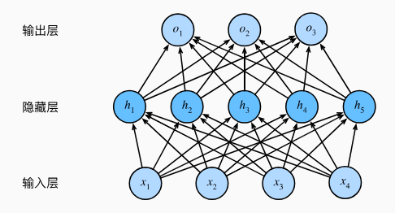

这个多层感知机有4个输入，3个输出，其隐藏层包含5个隐藏单元，输入层不涉及计算，隐藏层和输出层有计算，这个 MLP 的层数为2

多层感知机在输出层和输入层之间增加一个或多个全连接隐藏层，并通过激活函数转换隐藏层的输出。

### 激活函数
将神经网络非线性化，如果不用激活函数，每一层输出都是上层输入的线性函数，无论神经网络有多少层，输出都是输入的线性组合

常用激活函数：ReLU、sigmoid、tanh

### 训练误差与泛化误差
**训练误差（training error）**：模型在训练数据集上计算得到的误差

**泛化误差（generalization error）**：模型应用在同样从原始样本的分布中抽取的无限多数据样本时，模型误差的 ***期望*** 。说白了就是在训练集上没见过的数据的错分样本比率？
### 训练集、验证集、测试集
常见做法是将我们的数据分成三份：
1. **训练集**：训练集用来训练模型，即确定模型的权重和偏置这些参数
2. **验证集**：验证集用于模型的选择，比较具有不同数量的隐藏层、不同数量的隐藏单元以及不同的激活函数组合的模型
3. **测试集**：测试集只使用一次，即在训练完成后评价最终的模型时使用

**K 折交叉验证：**

当训练数据稀缺时, 原始训练数据被分成 K 个不重叠的子集。 然后执行 K 次模型训练和验证

每次在 K-1 个子集上进行训练， 并在剩余的一个子集（在该轮中没有用于训练的子集）上进行验证

### 欠拟合与过拟合
**欠拟合**：训练误差和验证误差都很严重， 但它们之间仅有一点差距

**过拟合**：训练误差明显低于验证误差时要小心

<!-- 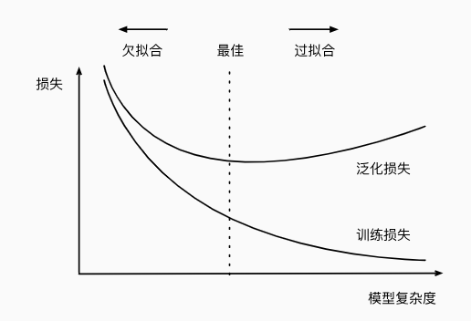 -->

### 权重衰减
**目的**：限制模型复杂度，抑制模型的过拟合，提高模型的泛化性

**方法**：在训练集的损失函数中加入惩罚项，以降低学习到的模型的复杂度， 将原来的训练目标最小化训练标签上的预测损失， 调整为最小化预测损失和惩罚项之和

正常的损失函数：

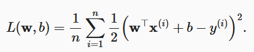

加入一个额外的损失 **（权重的L2范数）** 来限制权重向量的大小，通过 **正则化常数 λ** 平衡这个新的额外惩罚的损失

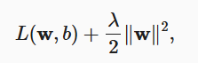

https://blog.csdn.net/zhaohongfei_358/article/details/129625803

### 前向传播、反向传播、计算图

**前向传播**：按顺序（从输入层到输出层）计算和存储神经网络中每层的结果。

输入样本为 $\mathbf{x}$ 中间变量为 $\mathbf{z}$，$\mathbf{W}^{(1)}$ 为隐藏层的权重参数
$$\mathbf{z}= \mathbf{W}^{(1)} \mathbf{x}$$
激活函数为 $\phi$
$$\mathbf{h}= \phi (\mathbf{z})$$
输出层的参数只有 $\mathbf{W}^{(2)}$
$$ \mathbf{o}= \mathbf{W}^{(2)} \mathbf{h} $$
损失函数 l 样本标签 y
$$L = l(\mathbf{o}, y)$$
正则化项（权重衰减）为
$$ s = \frac{\lambda}{2} \left(\|\mathbf{W}^{(1)}\|_F^2 + \|\mathbf{W}^{(2)}\|_F^2\right)$$
最后，模型在给定数据样本上的正则化损失为
$$J = L + s.$$
将 $J$ 称为目标函数（objective function）

前向传播的计算图如下，其中正方形表示变量，圆圈表示操作符。左下角表示输入，右上角表示输出

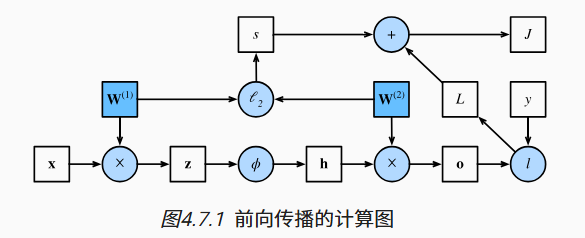

**反向传播**：（backward propagation或backpropagation）指的是计算神经网络参数**梯度**的方法

在上面计算图中，反向传播用于计算梯度 $\partial J/\partial \mathbf{W}^{(1)}$ 和 $\partial J/\partial \mathbf{W}^{(2)}$ 应用链式法则，依次计算每个中间变量和参数的梯度

### 参数初始化
Xavier 初始化可以避免梯度消失和梯度爆炸

## 4.2 深度学习计算
### 层和块
块（block）可以描述单个层、由多个层组成的组件或整个模型本身
 
块负责大量的内部处理，包括参数初始化和反向传播

### 参数管理、读写文件

## 4.3 卷积神经网络
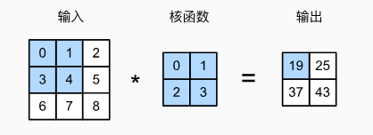

卷积层对输入和卷积核权重进行互相关运算，并在添加标量偏置之后产生输出

卷积层中的两个被训练的参数是卷积核权重和标量偏置

感受野：指特征图上的某个点能看到的输入图像的区域，特征图上的点是由输入图像中感受野大小区域的计算得到的

### 填充和步幅
在应用多层卷积时，我们常常丢失边缘像素，在周围填充一圈0

卷积神经网络中卷积核的高度和宽度通常为奇数，保持空间维度的同时，可以在顶部和底部填充相同数量的行，在左侧和右侧填充相同数量的列

步幅分为水平步幅和垂直步幅

填充和步幅可用于有效地调整数据的维度

### 多通道输入输出

多通道输入：需要构造一个与输入数据具有相同输入通道数的卷积核：两个通道则需要两个卷积核

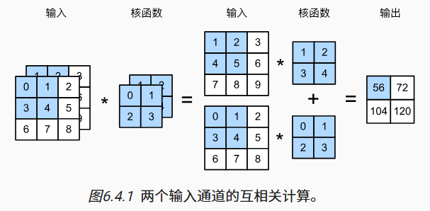

多通道输出：

1*1 卷积层通常用于调整网络层的通道数量和控制模型复杂性

## 4.4 Transformer

**encoder - decoder:** 

将输入编码为向量，n 个输入（x1 ... xn）编码为 n 个向量（z1 ... zn），解码器将 n 个向量生成 m 个输出（z1 ... zm）。对于编码器来说，可以看到整个输入一次性编码；解码器只能一个一个生成，输出 y 2 需要 y 1，之前的输出也作为当前时刻的输入。

**attention：**
mask 作用是防止 t 时刻看到以后的东西

## 4.5 注意力机制
权重的分布

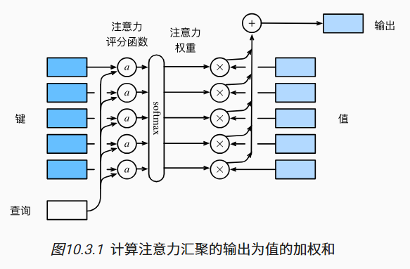

**标量注意力：**
其中每个注意力权重是一个标量值

**向量注意力：**
其中每个注意力权重是一个向量，在更细粒度的水平上对不同的维度进行加权

## 4.6 nn.Conv1d
https://cloud.tencent.com/developer/article/2061820

    torch.nn.Conv1d(in_channel, dim, 1)

对一个序列做卷积，当卷积核为 2 时，序列变短了，当卷积核为 1 时，序列长度不变

dim 表示输出的特征维度，相当于一个全连接层，可以进行维度的升高与降低

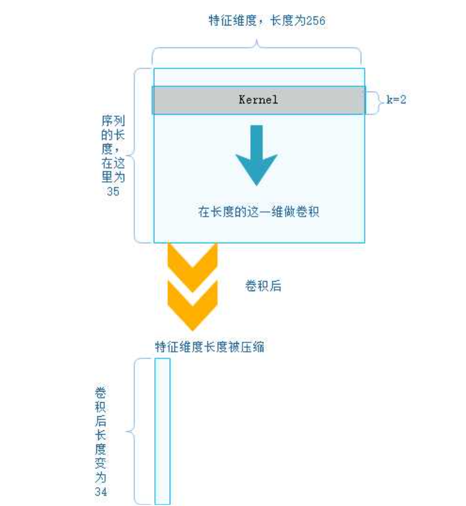

## 4.7 nn.Conv2d

    nn.Conv2d(in_dim, out_dim, kernel_size)

    input: torch.randn(5,in_dim,20,3)
    nn.Conv2d(in_dim, out_dim, 1)
    out put: torch.Size([5, out_dim, 20, 3])

卷积核大小为 1，对于图像来说，不改变 H W，也就是后两个维度，只改变特征通道数

## 4.8 nn.BatchNorm1d

    points66 = torch.tensor([[[1, 2, 3, 3],
                              [4, 2, 2, 7],
                              [1, 6, 3, 4]],
                      
                             [[6, 1, 3, 1],
                              [4, 8, 0, 5],
                              [1, 0, 5, 4]]]) # [2, 3, 4] [batch, Feature, N] 这样的格式cv用的多
    points66 = points66.float()
    bn = nn.BatchNorm1d(3)     # 输入张量的特征维度
    points_bn = bn(points66)

Batch Norm 对于不同的 Batch 的同一个特征做归一化，batch1 的第一行为4个点的x值，batch2 的第一行为4个点的x值

bn是对于特征操作，计算过程：

第一个 batch 中 [1, 2, 3, 3] 和 第二个 batch 中 [6, 1, 3, 1] 求均值 μ 和方差 σ^2, 

输出第一个 batch 第一行：(1-μ) / (σ^2-ε)^0.5 , (2-μ)/(σ^2-ε)^0.5, (3-μ)/(σ^2-ε)^0.5, (3-μ)/(σ^2-ε)^0.5

输出第二个 batch 第一行：(6-μ) / (σ^2-ε)^0.5, (1-μ)/(σ^2-ε)^0.5, (3-μ)/(σ^2-ε)^0.5, (1-μ)/(σ^2-ε)^0.5

## 4.9 nn.LayerNorm

    points66 = torch.tensor([[[1, 2, 3, 3],
                              [4, 2, 2, 7],
                              [1, 6, 3, 4]],

                             [[6, 1, 3, 1],
                              [4, 8, 0, 5],
                              [1, 0, 5, 4]]]) # [2, 3, 4] [batch, N, Feature] 这种格式NLP用的多
    points66 = points66.float()
    bn = nn.LayerNorm(normalized_shape=[4])

LayerNorm 是对一个样本（batch）进行操作，与另一个batch无关 **normalized_shape=[4]** 表示只对最后一个维度（特征）操作

第一个 batch 中 [1, 2, 3, 3] 均值：2.25   和方差 σ^2 = 0.6875

输出第一个 batch 第一行：(1-μ) / (σ^2-ε)^0.5 , (2-μ) / (σ^2-ε)^0.5, (3-μ)/(σ^2-ε)^0.5, (3-μ)/(σ^2-ε)^0.5

    points66 = torch.tensor([[[1, 2, 3, 3],
                              [4, 2, 2, 7],
                              [1, 6, 3, 4]],
                      
                             [[6, 1, 3, 1],
                              [4, 8, 0, 5],
                              [1, 0, 5, 4]]]) # [2, 3, 4] 
    points66 = points66.float()
    bn = nn.LayerNorm(normalized_shape=[3, 4])

**normalized_shape=[3, 4]** 对 3*4 12个值进行归一化

求 [1, 2, 3, 3, 4, 2, 2, 7, 1, 6, 3, 4] 的均值和方差 

    mean1 = points66.mean()

    var1 = points66.var(unbiased=False)

#  5. 点云语义分割
<!-- 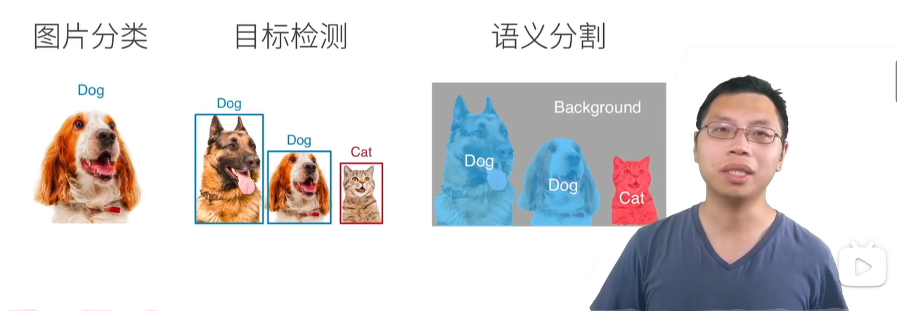
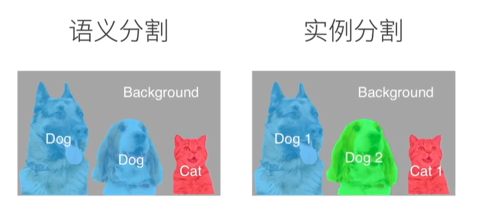 -->

分类 目标检测 语义分割 区别
语义分割给每个像素一个 label

## 5.1 Point Net
在 Point Net 之前，将点云转换为栅格，用 3D CNN 处理，但是分辨率降低；或使用投影的方法，用 2D CNN 处理。

对于点云数据，**网络输入是无序的** 且 **不同视角结果应该是一样的**

对于无序数据，对称函数不用在意输入数据的顺序，比如 max 函数，point net 的核心思想是构造一个复合函数，其中一层是对称函数，整个网络也就是对称函数

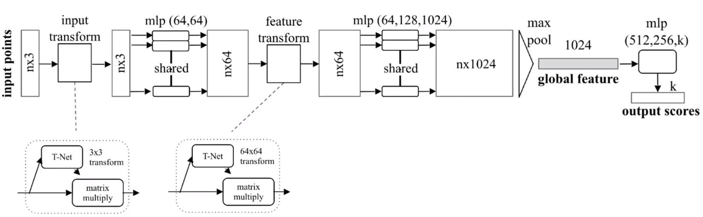

分类网络：
1. 输入点云通过一个 input transform 转换视角，T-Net 为 3 * 3 的矩阵，与输入进行矩阵乘法，得到的还是n*3 的矩阵
2. 每个点通过同一个 mlp 扩展维度，3维到64维
3. 再通过一个特征转换视角的模块（Point Net++ 去掉了）
4. 通过 mlp 升维到 1024 维，n * 1024
5. 经过一个 max pool 得到 1*1024 的向量
6. 通过一个 mlp 变成 k 维，1*k 表示这组点云在每一个类别上的得分

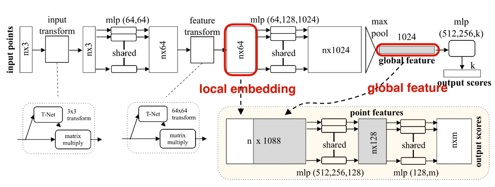

分割网络（每个点都有 k 个得分）：

1. 将每个点的局部特征和全局特征拼接在一起，变成了 n*(64 + 1024)
2. 进行 mlp 变成 1088 维，再通过 mlp 变成 n*m 的得分

**从 global feature 可以获得点云的 critical points**

## 5.2 Point Net++
Point Net 中，一个点自己经过mlp扩展特征维度，Point Net++通过点与其周围的点进行扩展维度

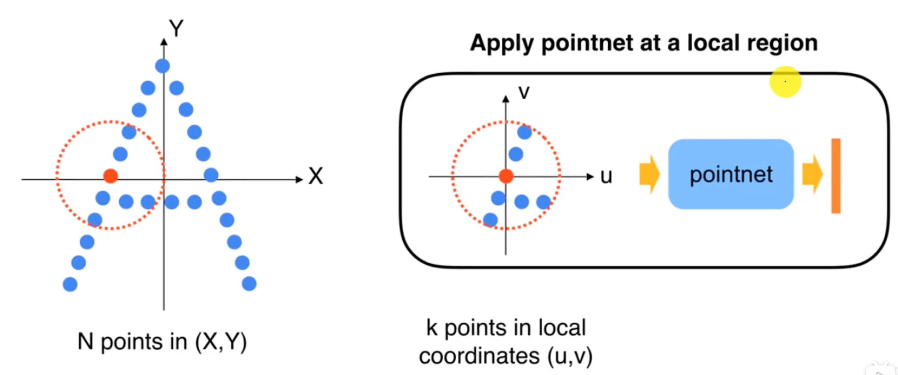

**sampling -> grouping -> pointnet**

sampling: uniform sampling, FPS

grouping: KNN, Ball query

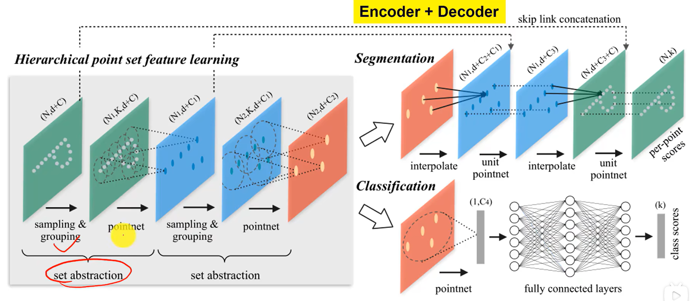

1. 对点云进行采样与聚合，经过一个 point net 点数量减少，特征维度增加
2. 再进行上面的过程，获得红色的数据
3. 分类：红色的全局特征经过point net 和 mlp 得到分类得分
4. 分割：红色的全局特征经过插值，再与之前蓝色的数据进行拼接，经过point net再插值拼接，获得每个点的得分

在 Point Net++ 中，grouping 环节受到点密度的影响，离激光雷达近的地方点密度大，远的地方密度小，在远的地方用球采样，可能导致球里面点很少，影响特征提取。文章中提出 **MSG** 和 **MRG** 解决，MSG 在同一级别上用不同大小的半径提取特征，并进行拼接；MRG 在不同级别上提取特征进行拼接。

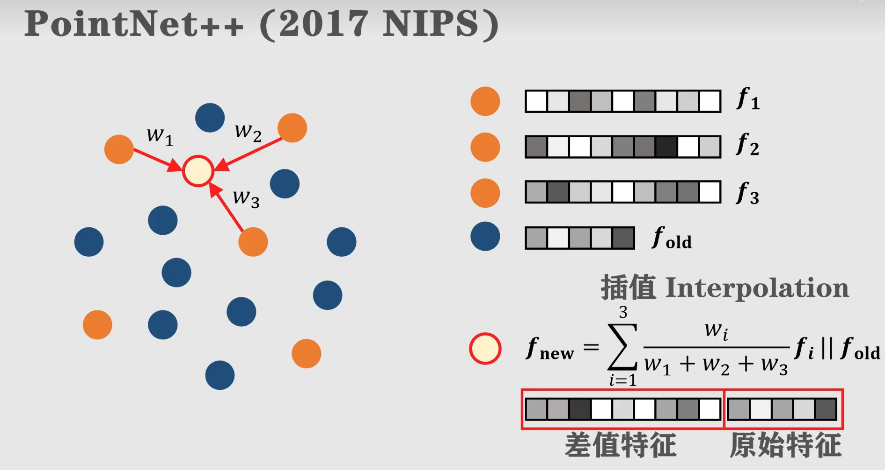

在分割任务中，需要恢复点的数量，找要恢复的点最近的三个上层点，使用距离的倒数作为权重进行插值，再将原来的特征拼接再后面

# 6. 点云补全
## partial to complete
[VQ VAE 介绍](https://zhuanlan.zhihu.com/p/633744455)

[VAE 介绍](https://zhuanlan.zhihu.com/p/574208925)

问题：模型推理的过程中，VQ VAE解码器的输入是什么

## 配 EditVAE 环境
conda 环境名：editvae2

1. 安装 [PyTorchEMD](https://github.com/daerduoCarey/PyTorchEMD)
  
   环境配置：torch version: 1.13.0+cu117      CUDA version: 11.7
   
   在 cuda/emd_kernel.cu 中：
   
   1. 注释掉 #include <THC/THC.h> 
   
   2. Replace all THCudaCheck with C10_CUDA_CHECK
   
   3. CHECK_EQ(a, b); -> TORCH_CHECK_EQ(a, b);
   
   4. AT_CHECK(a == b, "Error message"); -> TORCH_CHECK(a == b, "Error message");

    编译的时候使用 python setup.py install 报错 没有权限，sudo python setup.py install 也不行，没有命令，使用 sudo python3 setup.py install 报错没有 torch，原因是 sudo 用的 base 的环境，不是自己的 conda 环境。最后使用 sudo -E python3 setup.py install 成功编译，sudo -E 保留当前用户的环境变量

    配置完 PyTorchEMD 并通过测试

2. 装完之后要将 emd_cuda.cpython-37m-x86_64-linux-gnu.so 文件放在 utils 下，一定要用 python3.7 编译PyTorchEMD， 后面发现还有一个库 fast_sampler 是用 python3.7 完成编译的。
但是使用 sudo -E python3 setup.py install 编译python环境又变成了 3.8，应该使用 ：   
      sudo -E /home/ps/anaconda3/envs/editvae_3.7/bin/python3.7 setup.py install
3. 报错：

   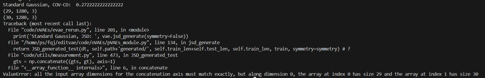

   measurement.py 473行 gts = np.concatenate((gts, gt), axis=1) 有 bug，直接注释了

## AnchorFormer
传统方法：输入点云 --> 全局特征向量 --> 稠密点云 **池化操作会导致点云细节缺失**

AnchorFormer：输入点云 --> Anchors --> 稀疏点云 --> 稠密点云

1. 通过基于输入部分观察的点特征学习一组 **锚点** 来模拟区域区分
2. **锚点** 通过估计特定的偏移量来分散到观察到的位置和未观察到的位置并与输入观测的下采样点形成稀疏点云
3. 为了获得稠密点云，将稀疏点各个位置的规范 2D 网格变形为详细的 3D 结构

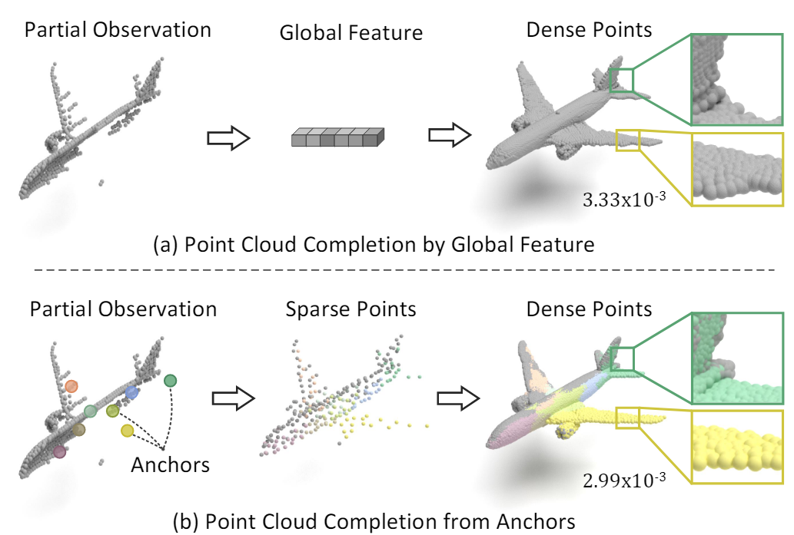

锚点可以推断观察到的点的关键模式还能表示缺失的部分，将输入观测的锚点和下采样的点作为稀疏点，再扩充成稠密点

1. 首先对输入点进行下采样，并通过基于 EdgeConv 的头部提取点特征
2. Transformer 编码器将下采样点的点特征作为输入，并学习在编码器的每个基本块中预测一组坐标，即锚点
3. 同时，下采样点和锚点的点特征也通过编码器进行细化、
4. 通过学习特定的偏移量，锚点进一步分散到不同的3D位置
5. 最后，AnchorFormer 将下采样点和锚点组合为稀疏点

### Anchor Generation
**特征提取：**

1. 下采样：FPS 最远点 得到 S 0
2. 特征提取：EdgeConv 得到 F 0

**锚点预测：**

双重注意力模块为 transformer 编码器，
当前的双重注意块预测一组新的锚点，同时细化前一个块的输入点特征

为了表征未观察部分，提出**特征扩展模块**：
1. 利用输入点特征与相应池化特征向量之间的特征差异进行锚点特征预测。
2. 利用预测的锚点特征和输入点特征之间的交叉注意进行锚点坐标学习。

流程：
1. 通过自注意力机制增强特征；F i-1 --> X i
2. 池化 X i 得到 g i；X i --> g i
3. 对增强点特征 Xi 与相应池化特征向量 g i 之间的特征差进行线性投影，得到锚点特征；X i' = MLP ( gi - Xi )
4. 增强点特征  Xi、预测的锚点特征 X i'、输入点 S i-1 通过交叉注意力机制得到预测的锚点坐标 a i

### Anchor Scattering
锚点 + 输入的下采样点 --> 丰富稀疏点细节

缺失部分的空间没有足够的锚点来促进详细的结构重建，通过学习特定的偏移量 ∆A  来将锚点分散到不同的位置

分散后的锚点 A′ = A + ∆A

稀疏点云 S：分散后的锚点 和 输入残缺点云下采样的点

### Point Morphing

## Point Transformer
**自注意力网络在 3D 点云处理中的应用**

基于投影的网络：将点云投影到各个平面，没有充分利用点云的稀疏性，影响 3D 中的识别性能和遮挡可能会阻碍准确性

基于体素的网络：计算量大

基于点的网络：设计了直接摄取点云的深度网络结构

基于 Transformer 和 自注意力：3D 点云本质上是具有位置属性的点集，自注意力机制似乎特别适合这种类型的数据，局部应用  selfattention

### Point Transformer Layer

使用的是向量注意力权重

### Position Encoding

δ = θ ( p i − p j ) 

p i 和 p j 为三维坐标，编码函数 θ 是一个具有两个线性层和一个 ReLU 非线性的 MLP

### Point Transformer Block

### Network Architecture

## SeedFormer
贡献：
1. 引入了一种新的形状表示，即Patch Seed，它不仅从部分输入中捕获一般结构，而且还保留了局部模式的区域信息
2. 设计了一种新的点生成器，即上采样 Transformer，通过将 Transformer 结构扩展到生成点的基本操作中。

解码阶段由两个主要步骤组成:
1. 首先从种子生成器中的不完整特征生成完整的形状
2. 然后以粗到细的方式恢复细粒度的细节

### Architecture Overview
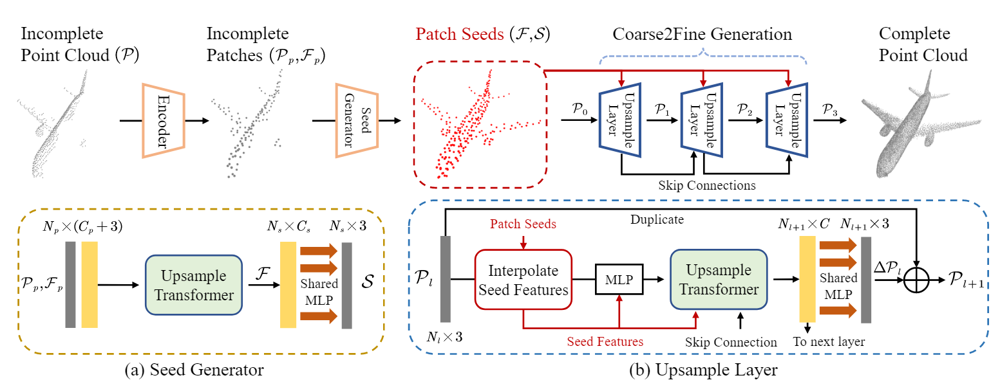

**Encoder：**

输入点云，使用 point transformer 和 abstraction layers 从残缺点云中提取特征，每往下一层点的数量逐渐减少，得到 patch 特征（Fp）和 patch 中心坐标（Pp），表示点云的部分结构

**Seed generator：**

生成一个粗略但完整的点云（seed points）以及每个点的种子特征；

给定提取的 patch 特征 Fp 和中心坐标 Pp，使用Upsample Transformer 生成一组新的种子特征 F，F 通过 MLP 生成相应的 seed points。

**Coarse-to-fine generation：**

使用Upsample Transformer将输入点云中的每个点上采样到 rl 个点，馈送到第一层的粗略点云 P0 是通过使用最远点采样(FPS)融合种子S和输入点云P来生成的

### Point Cloud Completion with Patch Seeds
**Patch Seeds:**

由种子坐标 S 和特征 F 组成，每个种子覆盖该点周围的一个小区域

### 确定一个 seedformer 测试集

ShapeNet-55 的数据格式：(8192, 3)，将 ShapeNet-55 test.txt 中的数据弄成 partial points (2048, 3)

## PointAttN

**几何细节感知单元(GDP):**

对 xi 进行 knn 得到最近邻点，根据 k 个最近邻点，建立点 xi 的特征，**接收域有限**。

使用交叉注意来建立输入点云特征与其下采样点云特征之间的点关系。

KNN 只是提取 xi 的最近邻点，而真正与 xi 相关的点可能不在最近的点里面

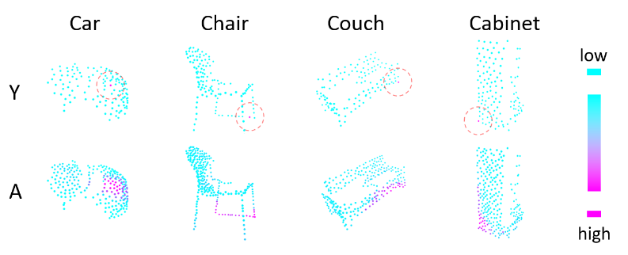

**自特征增强单元(SFA):** 

自注点意力建立输入点云中点之间的关系，允许云中的每个点特征来增强其全局感知能力，来预测完整云

SFA 接收输入 (X, u)，其中 X 是 n × c 的矩阵，u 是上采样比，SFA 的输出是一个大小为 n × uc 的矩阵

## WalkFormer

基于特征相似度对局部主导点进行采样，并移动点形成缺失的部分

### Point Walk
**Neighbour Similarity Sampling：**

选取要移动的点，FPS 等下采样方法会导致从具有独特几何信息的外部区域中选择点

邻域相似性采样：先用 FPS 获得相对均匀的质心，得到 i 个质心，通过球查询算法得到每个质心半径内的 K 个点，算一个质心球中找一个点使特征余弦相似度最大，这个点作为一个 walk 起始点

**Point Selector：**

点进行 walk，walk 过程定义为一个序列 ω ，用 π(·) 来指导行走过程中下一个点的选择。

## Zero-shot
对于给定的部分点云Pin，我们首先将其转换为带点云着色的参考图像Iin和3D高斯Gin，将Iin和Gin引入到 Zero-shot 分形补全中,生成完成的点云Pout

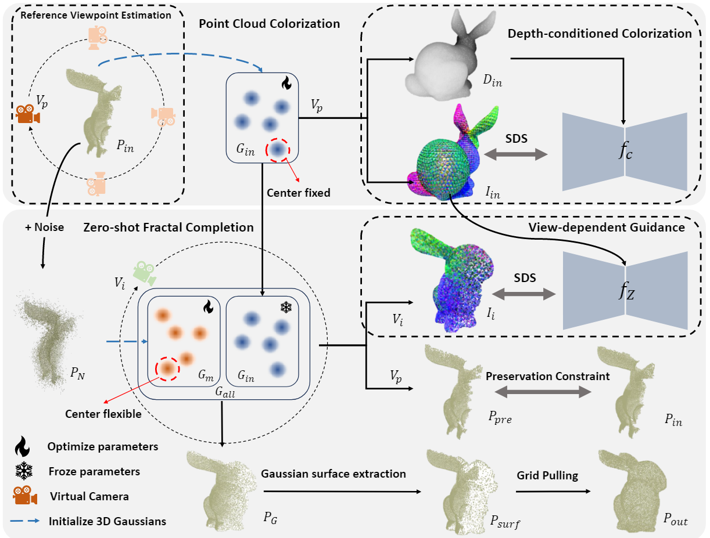

### Point Cloud Colorization:

通过 reference viewpoint estimation 获得相机位姿 Vp，Pin 初始化 3DGS 得到 Gin，Gin的中心是固定的，以保持Pin的形状。

# 7. Conda
## 解决 conda 权限问题
报错：

    EnvironmentNotWritableError: The current user does not have write permissions to the target environment.
      environment location: /home/ps/anaconda3/envs/Seedformer
      uid: 1000
      gid: 1000

解决：

    sudo chmod -R 777 /home/ps/anaconda3/envs/Seedformer

可以正常安装：

    conda install pytorch==1.13.1 torchvision==0.14.1 torchaudio==0.13.1 pytorch-cuda=11.7 -c pytorch -c nvidia

# 8. 实验记录
## model_addkp

### v 0.5
模型中加入 64 个 3DGS 采样点，每个 3DGS 采样 30 个点
主要修改部分：

    class FeatureExtractor(nn.Module)

next: **尝试引入点云法向量特征**

gpt建议：

1. 将法向量作为附加输入特征
将点云的法向量与点的坐标结合起来作为模型输入，法向量可以扩充点的几何信息，有助于模型学习局部表面细节。

input_features = torch.cat([points, normals], dim=-1)  # (B, N, 6)

2. 在特征提取模块中融合法向量
如果不想直接作为输入，可以在特征提取阶段引入法向量，将法向量作为局部几何描述，与点的坐标或其他特征进行融合。

方法：
将法向量与点的局部特征通过注意力机制、加权平均或 MLP 结合。
在特征提取模块中使用法向量指导特征的聚合或更新。

3. 设计法向量一致性损失
引入法向量损失约束补全点云的法向量与真实法向量一致，从而提高补全质量。

方法：
计算补全点云的法向量，与真实点云法向量对齐。
使用 余弦相似性损失 或 方向一致性损失

4. 使用法向量辅助点云补全（联合学习）
设计双任务网络，既预测完整点云的坐标，也预测补全点云的法向量。通过学习法向量，可以进一步提升点云的几何细节。
方法：
网络输出： 模型同时输出点云的坐标和法向量。
损失函数： 在位置损失（如 Chamfer Distance）基础上增加法向量一致性损失。

5. 点云和法向量的对比学习
使用对比学习方法，引导模型学习更细致的表面结构。可以构建点对间的法向量相似性，约束补全点云的局部几何。
